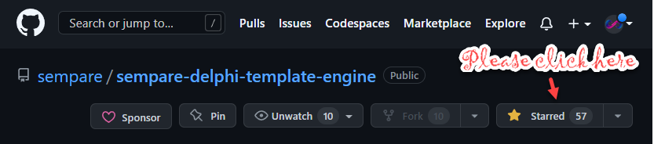

 


#  Sempare Template Engine

Copyright (c) 2019-2023 [Sempare Limited](http://www.sempare.ltd)

Contact: <info@sempare.ltd>

License: [GPL v3.0](https://www.gnu.org/licenses/gpl-3.0.en.html) or [Sempare Limited Commercial License](./docs/commercial.license.md)

Open Source: https://github.com/sempare/sempare-delphi-template-engine

## Contents
1. [Introduction](#Introduction)
2. [Quickstart](#Quickstart)
3. [Features](#Features)
4. [Objectives](#Objectives)
5. [Requirements](#Requirements)
6. [Installation: GetIt](#GetIt)
7. [Installation: Delphinus](#DelphinusSupport)
8. [Installation: Manual Install](#ManualInstall)
9. [Feedback](#Feedback)
10. [Statements](./docs/statements.md)
11. [Expressions](./docs/expressions.md)
12. [Builtin functions](./docs/builtin-functions.md)
13. [Builtin variables](./docs/builtin-variables.md)
14. [Custom functions](./docs/custom-functions.md)
15. [Configuration](./docs/configuration.md)
16. [Components](./docs/components.md)
17. [Tricks](./docs/tricks.md)
18. [Template Patterns](./docs/template-patterns.md)
19. [Internals](./docs/internals.md)
20. [Restrictions/Limitations/Known Bugs](./docs/restrictions.md)
21. [License](#License)

## Introduction

Template engines are used often in technology where text needs to be customised by substituting variables with values from a data source. Examples where this may take place:
- web sites using template engines (for server side scripting)
- code generation
- mail merge 
- notification messages 

The Sempare Template Engine is a small templating engine for [Delphi](https://www.embarcadero.com/products/delphi) (Object Pascal) that allows for templates to be created easily and efficiently by providing a simple and easy to use API.

Example usage:
```
program Example;
uses
    Sempare.Template;
type
    TInformation = record
        name: string;
        favourite_sport : string;
        count : integer;
    end;
begin
    var tpl := Template.Parse(
	       'My name is <% name %>.'#13#10 + 
	       'My favourite sport is <% favourite_sport %>.'#13#10 + 
	       'Counting... <% for i := 1 to count %><% i %><% betweenitems %>, <% end %>'
	);
    var info : TInformation;
    info.name := 'conrad';
    info.favourite_sport := 'ultimate';
    info.count := 3;
    writeln(Template.Eval(tpl, info));	
end.
```

The project uses Run-time Type Information (RTTI) to allow for almost any type to be dereferenced within the template script.

In the example above, you can see that the '<%' start and '%>' end the scripting statement respectively. Within a scripting statement, you can reference variables, assign variables, use conditions, for and while loops, and include other templates.

**NOTE** In examples in this documentation I may use the latest Delphi syntax, e.g. inline variable declarations. This is not backward compatible as they were introduced in Delphi 10.2 and are used to shorten the code/examples being illustrated in the documentation. The codebase will attempt to be as backward compatible as possible.

## Call to action

Please 'star' the project on github.



## Quickstart

[Try the demo](./demo/VelocityDemo/README.md) if you want to dive in quick and play with the template engine.

Quick tutorials on [You Tube](https://www.youtube.com/playlist?list=PLjjz4SuVScHreGKEInvrjPtLPMBU6l130). 
The playlist has a few videos that are very short (most less than a minute - blink and they are done). You can drag the slider in the videos if you miss something or refer to the rest of the documentation. 


## Features
- statements
  - if, elif, else statements
  - for and while statements
  - include statement
  - extends / block statements
  - with statement
  - function/method calls
- expressions
  - simple expression evaluation (logical, numerical and string)
  - variable definition
  - functions and methods calls
  - dereference records, custom managed records, classes, arrays, JSON objects, TDataSet descendants and dynamic arrays
  - ternary operator
- safety
  - max run-time protection
- customisation 
  - custom script token replacement
  - add custom functions
  - strip recurring spaces and new lines
- lazy template resolution
- parse time evaluation of expressions/statements
- allow use of custom encoding (UTF-8 with BOM, UTF-8 without BOM, ASCII, etc)
- extensibile RTTI interface to easily dereference classes and interfaces (current customisations for ITemplateVariables, TDictionary, TJsonObject)

## Objectives

The Sempare Template Engine is not intended to be a fully featured general purpose programming language such as PHP where the script itself could be a self contained programming language (but it does have most of the features).

Sempare Template Engine aims to provide just enough functionality to allow you to easily work with the 'view' aspects of a template. Any enhanced functionality required from the scripting environment should be provided by the custom functions written in Object Pascal.

## Requirements

The template engine works with modern versions of [Delphi](https://www.embarcadero.com/products/delphi). 

Tests currently run using the DUnitX TestFramework.

An attempt has been made not to use the latest features to ease backward compatability. The following versions have been tested:

- Delphi XE 4 to XE 9
- Delphi 10.0 Seatle
- Delphi 10.1 Berlin
- Delphi 10.2 Tokyo
- Delphi 10.3.3 Rio
- Delphi 10.4 Sydney
- Delphi 11.0 to 11.3 Alexandria

There should be no platform specific restrictions.

Have a look at Sempare.Template.Compiler.inc. The following defines can be defined if appropriate:

- SEMPARE_TEMPLATE_NO_INDY - if Indy is not present. This is used to access an html encoder if TNetEncoding is not available.
- SEMPARE_TEMPLATE_CONFIRM_LICENSE - if present, you confirm you understand the conditions.

<a name="GetIt"><h2>Installation: GetIt</h2></a>

The Sempare Template Engine for Delphi can be installed via the [Embarcadero GetIt manager](https://getitnow.embarcadero.com/?q=sempare&product=rad-studio)

This will add the *src* folder to the search path so you can start working immediately.

<a name="DelphinusSupport"><h2>Installation: Delphinus Support</h2></a>

The Sempare Template Engine for Delphi can be installed via the [Delphinus](https://github.com/Memnarch/Delphinus) package manager.

This will add the *src* folder to the search path so you can start working immediately.

<a name="ManualInstall"><h2>Installation: Manual Install</h2></a>

Start by adding the *src* folder to the Delphi search path. Otherwise, there are some projects you can use:

Open __Sempare.Template.Engine.Group.groupproj__ which will include:

- __Sempare.Template.Pkg.dproj__

  The core template project. (runtime)
     
- __Sempare.Template.Tester.dproj__

   100+ unit tests

- __demo\VelocityDemo\Sempare.Template.Demo.dproj__

   The velocity real-time demo.   
   
   
## Feedback

You can raise issues on [GitHub](https://github.com/sempare/sempare.template) and they will be addressed based on priority.

Most features have some basic tests in place. If a bug is been discovered, please include a basic test/scenario replicating the issue if possible as this will ease the investigation process.

# Contributions

Review [contibution terms and conditions](./docs/CONTRIBUTION.pdf) to contribute to the project.

# License

The Sempare Template Engine is dual-licensed. You may choose to use it under the restrictions of the [GPL v3.0](https://www.gnu.org/licenses/gpl-3.0.en.html) at
no cost to you, or you may license it for use under the [Sempare Limited Commercial License](./docs/commercial.license.md)

The dual-licensing scheme allows you to use and test the library with no restrictions, but subject to the terms of the GPL. A nominal fee is requested to support the maintenance of the library if the product is to be used in commercial products. This support fee binds you to the commercial license, removing any of the GPL restrictions, and allowing you to use the library in your products as you will. The Sempare Template Engine may NOT be included or distributed as part of another commercial library or framework without approval / commercial review.

A commercial licence grants you the right to use Sempare Template Engine in your own applications, royalty free, and without any requirement to disclose your source code nor any modifications to
Sempare Templte Engine or to any other party. A commercial licence lasts into perpetuity, and entitles you to all future updates.

A commercial licence is provided per developer developing applications that uses the Sempare Template Engine. The initial license fee is $70 per developer and includes the first year of support.
For support thereafter, at your discretion, a support fee of $30 per developer per year would be appreciated. Please contact us for site license pricing.

Please send an e-mail to info@sempare.ltd to request an invoice which will contain the bank details.

Support and enhancement requests submitted by users that pay for support will be prioritised. New developments may incur additional costs depending on time required for implementation.
